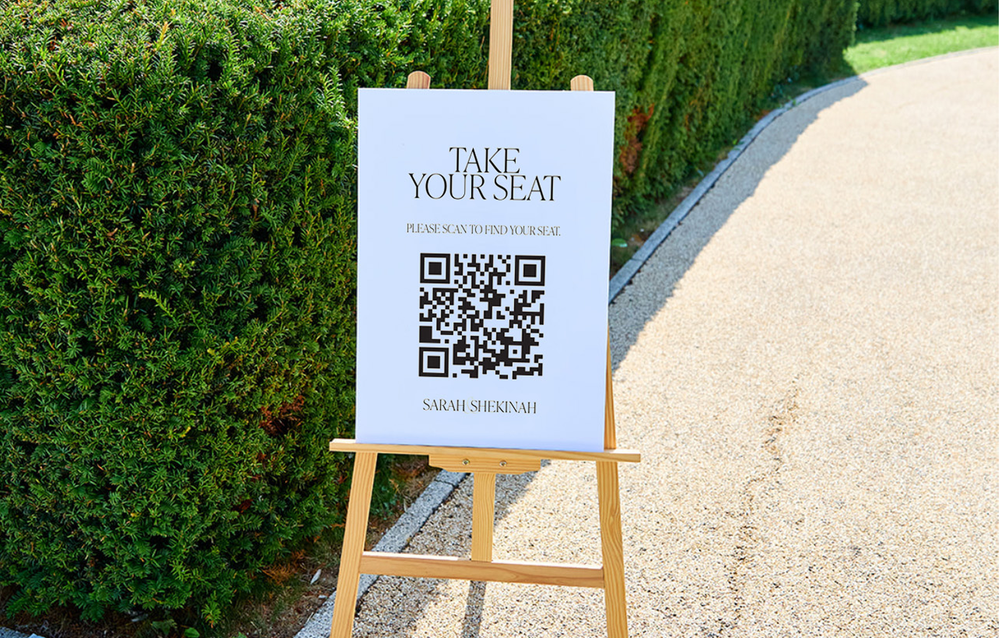
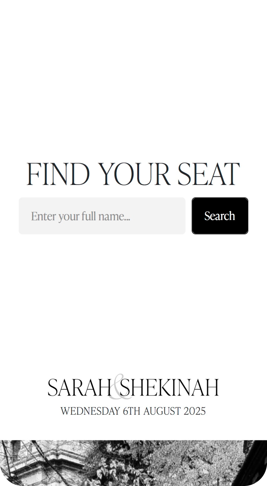
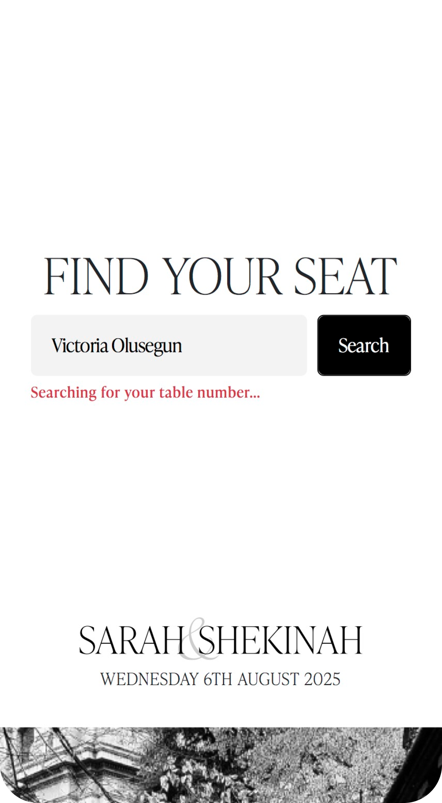
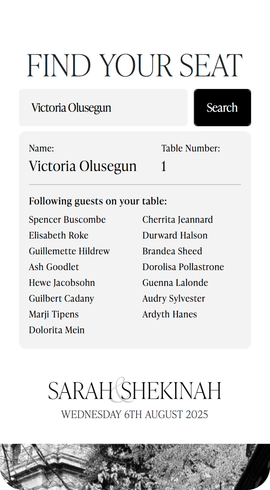
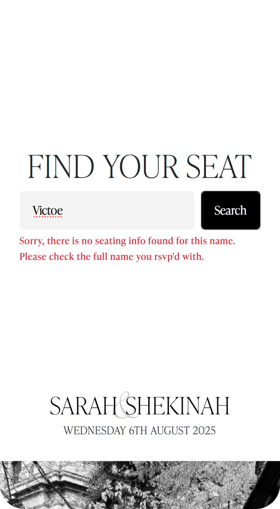
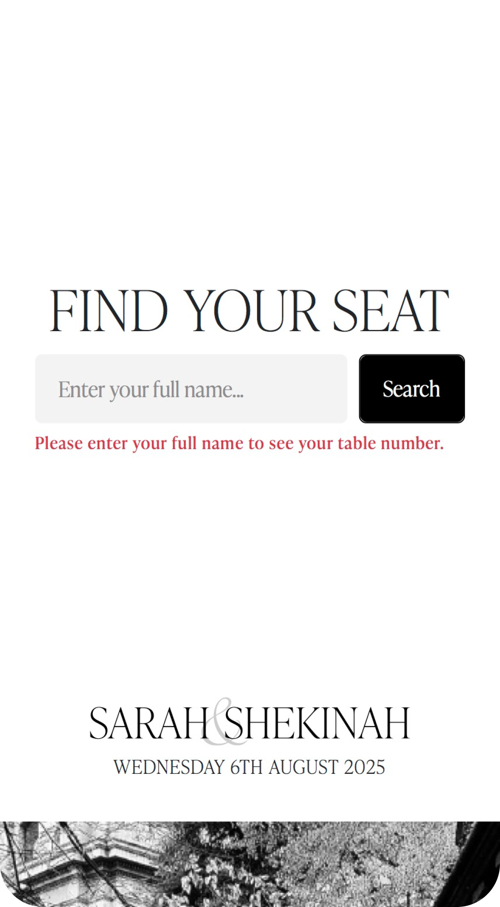

# Wedding Seating Chart 💍

A mobile-first guest seating application built for a private wedding reception, allowing guests to find their assigned table from their phones.


> **🔐 Project Disclaimer & Privacy Notice:** This application was custom built for a private wedding reception, which has now concluded. To protect guest privacy all real guest names have been replaced with mock data.

🔗 [Live Demo](https://malalu-seating-chart.netlify.app/)

## 🪧 The Problem

The client requested a digital system, that could be used live at the reception to help `over 300+` arriving guests instantly find their assigned tables. Their goal was to reduce confusion at the entrance and the wait time accessing the board.

## 📱 The Solution

The application was use as a mobile alternative at a private wedding reception.

**Guest User Journey:**

`Scan QR CODE -> Open Mobile Site -> Guest Searches Name -> View Table Assignment`

The guests scanned a QR code displayed at the venue, viewed the website on their phones and searched for their name to find their assigned table.

<table>
  <tr>
    <td>QR Code</td>
     <td>Mobile Site</td>
     <td>Guest Name</td>
     <td>Table Assignment</td>
  </tr>
  <tr>
    <td></td>
       <td></td>
     <td></td>
     <td></td>
    
  </tr>
 </table>

## 📋 Features

- **Guest Lookup:** Seating information for 240+ wedding guests was stored and made searchable through the application.
- **Search Functionality:** Guests could search their full name or first name to find their assigned table.
- **Responsive Design:** Designed for mobile devices so guests could access the seating chart from their phones at the venue.
- **Input Validation:** Handled empty searches and unsucessful lookups with clear error messages.
- **Supabase Integration:** Stored and retrieved guest and seating information using Supabase.

## 🚫 Validation and Edge Cases

<table>
  <tr>
     <td>Valid Search</td>
     <td>No Result</td>
     <td>Empty Input</td>
  </tr>
  <tr>
   <td></td>
    <td></td>
    <td></td>
  </tr>
 </table>

## 🪑 Tech Stack

- **Frontend:**    
- **Backend/Database:**  
- **Deployment:** 

## 📚 Improvements

If the application was developed futher, I would improve these features.

- **Admin Interface:** Allow event organisers to update guest and table assignments without editing the database directly.
- **Search:** Add more flexible search matching to handle variations in spelling or input.
- **Testing:** Add automated tests covering search, validation and seating lookup behaviour.

## 🛠️ Get Started

### Clone the repository

```
git clone https://github.com/Vicko657/wedding-seating-chart.git
cd wedding-seating-chart
```

### Configure environment variables

- Create a `.env` file in the project root, see `.env.example` for required variables.

### Build and run:

```
npm install
npm dev run
```

## 🌍 Deployment

This project is deployed on [Netlify](malalu-seating-chart.netlify.app/).
